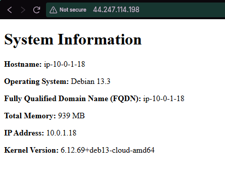

# ACIT 4640: Intro to Ansible Lab

- Charley Liao
- ACIT 4640

---

This project demonstrates the use of **Infrastructure as Code (IaC)** to provision cloud resources and **Configuration Management** to deploy a web server. 

This lab's workflow uses **Terraform** to create two EC2 instances on AWS and **Ansible** to install and configure Nginx on those instances.

---

## **Command Reference**

### **1. SSH Key Management**
Ansible requires an SSH connection to manage nodes. These commands create a local key pair and manage its existence in AWS.

- **Create new keys**: 
  Generates a secure ED25519 key pair named `aws`.
  ```bash
  ssh-keygen -t ed25519 -f ~/.ssh/aws -C "aws-lab-key"

- **Import Key to AWS**:
  Runs a script to upload the public key to our AWS account so EC2 instances can be launched with it.

  ```bash
  ./scrips/import_lab_key ~/.ssh/aws.pub
  ```

- **Delete Key from AWS**: Removes the public key from AWS to clean up the environment.

  ```bash
  ./scrips/delete_lab_key
  ```

### **2. Terraform Commands**
Used to provision the VPC, Subnet, Security Groups, and EC2 instances. These are to be run from the `terraform/` directory.

- Initialize:
Prepares the directory and downloads the AWS provider plugins.

  ```Bash
  terraform init
  ```

- Format:
Rewrites configuration files to a canonical format and style.

  ```Bash
  terraform fmt
  ```

- Validate:
Checks the syntax of the .tf files.

  ```bash
  terraform validate
  ```

- Plan:
Generates an execution plan showing what infrastructure will be created.

  ```bash
  terraform plan
  ```

- Apply:
Executes the plan to create the 2 Debian EC2 instances.

  ```bash
  terraform apply
  ```

### **3. Ansible Commands**

Used to configure the software on the running instances. These should be run from the root directory.

- Syntax Check:
Verifies the playbook.yml file for any YAML syntax errors before execution.

  ```bash
  ansible-playbook ansible/playbook.yml -i ansible/inventory/hosts.yml --syntax-check
  ```

- Run Playbook:
Executes the tasks to install Nginx, copy configurations, and deploy the template.

  ```bash
  ansible-playbook ansible/playbook.yml -i ansible/inventory/hosts.yml
  ```

### **Web Page**
Below is a screenshot of the `index.html` page served by Nginx on one of the EC2 instances. It shows that the configuration management was successful.

<p align="center">
  
</p>

### **Project Cleanup**

```bash
cd tereraform
terraform destroy
```
